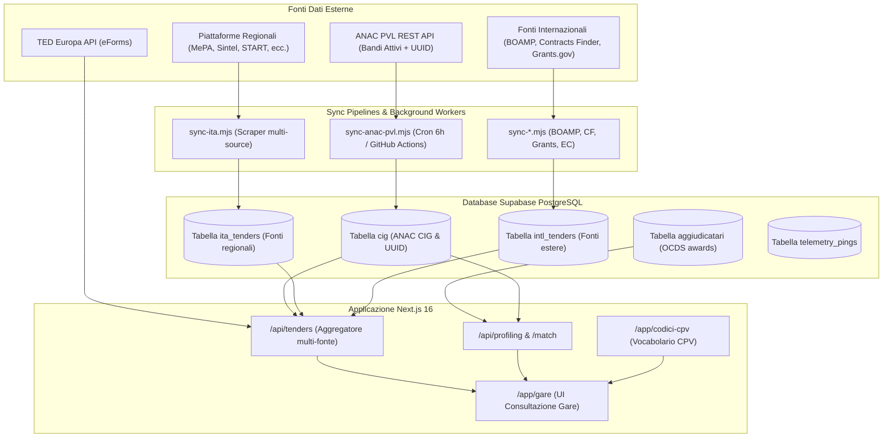

<!-- SPDX-License-Identifier: AGPL-3.0-only -->
<!-- Copyright (c) 2024-2026 Giacomo Marani <ing.giacomo.marani@gmail.com> -->
<!-- Project: ANAC-DB-codex — https://github.com/GiacomoMarani/ANAC-DB-codex -->
<!-- Watermark: GM-ANAC-7f3a9c2e-4b1d-4e8f-a5c3-2d9f0e1b6a4d -->

# Tender AI DB — ANAC-DB-codex

<div align="center">


**Piattaforma avanzata di intelligence, aggregazione e analisi delle gare d'appalto pubbliche italiane, europee e internazionali.**

[Funzionalità](#-funzionalità-chiave) • [Architettura](#-architettura-del-sistema) • [Setup Locale](#-installazione--avvio-rapido) • [Pipeline di Sincronizzazione](#-pipeline-di-sincronizzazione) • [API Reference](#-api-endpoints) • [Licenza](#-licenza--proprietà-intellettuale)

</div>

---

## 📌 Panoramica

**ANAC-DB-codex (Tender AI DB)** è un ecosistema completo per l'aggregazione, indicizzazione e consultazione rapida dei bandi di gara della Pubblica Amministrazione.

Il sistema supera la frammentazione dei portali d'appalto centralizzando e normalizzando in tempo reale dati provenienti da:
- **ANAC** (Banca Dati Nazionale dei Contratti Pubblici - BDNCP e Pubblicità Legale PVL)
- **TED Europa** (Tenders Electronic Daily)
- **Oltre 30 piattaforme regionali e nazionali italiane** (MePA / Consip, Sintel Lombardia, START Toscana, Intercent-ER, Sardegna CAT, TuttoGare, ESTAR, EmPulia, SoReSa, ecc.)
- **Bandi internazionali diretti**: 🇫🇷 Francia (BOAMP), 🇬🇧 Regno Unito (Contracts Finder), 🇺🇸 Stati Uniti (Grants.gov), 🇪🇺 Unione Europea (EU Funding & Tenders Portal)

---

## 🚀 Funzionalità Chiave

### 1. 🔍 Motore di Ricerca Gare Multi-Fonte
- **Aggregazione unificata**: Ricerca simultanea con schema dati normalizzato (`NormalizedTender`) tra decine di piattaforme.
- **Filtri multidimensionali**:
  - Full-Text Search indicizzata PostgreSQL con dizionario in lingua italiana.
  - Fasce di importo (€40k, €150k, €1M, €5M+).
  - Scadenza offerte (imminente a 7, 30, 90 giorni).
  - Categoria di contratto (*Lavori*, *Servizi*, *Forniture*).
  - Codici CPV prevalenti o specifici.
  - Localizzazione geografica (regione e provincia).
- **Deep Linking Certificato**: Link diretto alla scheda ufficiale della gara su [pubblicitalegale.anticorruzione.it](https://pubblicitalegale.anticorruzione.it) tramite identificativo UUID ANAC o codice CIG.

### 2. 🏢 Profilazione Rapida Aziendale (P.IVA / CF)
- **Matching istantaneo senza upload**: A differenza di soluzioni che richiedono il caricamento manuale di visure o documenti, il sistema analizza la Partita IVA in tempo reale.
- **Analisi dello storico aggiudicazioni**: Interroga i dataset Open Data OCDS di ANAC e il casellario SCP-MIT, estraendo le gare vinte, i ruoli (mandataria / mandante / singola) e i volumi aggiudicati.
- **Mappatura automatica dei CPV**: Ricava i codici CPV e le divisioni di reale operatività aziendale.
- **Matching predittivo bandi attivi**: Individua istantaneamente tutti i bandi aperti compatibili con il profilo dell'operatore economico.
- **Validazione P.IVA**: Controllo formale del checksum (algoritmo di Luhn / formula italiana delle 11 cifre) e verifica VIES.

### 3. 🌳 Browser Gerarchico del Vocabolario CPV 2008
- **Albero CPV Completo**: 9.454 codici ufficiali conformi al Regolamento CE 213/2008 distribuiti su 45 divisioni, gruppi, classi e categorie.
- **Ricerca Client-Side ultra-veloce**: Ricerca full-text fuzzy su etichetta e antenati con evidenziazione in tempo reale senza latenza server.
- **Prefix matching numerico**: Ricerca diretta per prefisso del codice CPV a 8 cifre.
- **Ricerca Semantica AI Opzionale**: Supporto a modelli Transformers locali via `@huggingface/transformers` (`Xenova/multilingual-e5-small`) per ricerca basata sul significato.

### 4. 📊 Dashboard Statistiche & Monitoraggio
- Monitoraggio volumetrie gare attive vs archiviate.
- Distribuzione temporale per anno e mese di pubblicazione.
- Ripartizione per categorie CPV e stazioni appaltanti.

---

## 🏗️ Architettura del Sistema



### Stack Tecnologico

- **Frontend**: Next.js 16 (App Router), React 19, TypeScript, Tailwind CSS v4, Radix UI, Lucide Icons.
- **Backend / API**: Next.js Server Components, Route Handlers, Edge Runtime per analisi rapide.
- **Database**: Supabase (PostgreSQL) con indici `GIN` su `tsvector` (`italian`), Row Level Security (RLS).
- **Scraping & Ingestion**: Node.js ES Modules, Playwright (per sorgenti con rendering dinamico), REST/Fetch client con rate limiting.
- **Machine Learning / NLP**: `@huggingface/transformers` (embeddings on-device client-side).
- **Deployment**: Vercel (Web App & Edge Functions) + GitHub Actions (Cron Jobs & Schedulazioni).

---

## 📂 Struttura del Progetto

```
ANAC-DB-codex/
├── app/
│   ├── api/
│   │   ├── cig/                 # Dettaglio singolo CIG
│   │   ├── cron/                # Endpoint triggerati da webhook/cron
│   │   ├── edge/analyze-site/   # Edge route per deduzione CPV da siti aziendali
│   │   ├── profiling/           # Profilazione per P.IVA (/api/profiling e /match)
│   │   ├── stats/               # Statistiche aggregate DB
│   │   └── tenders/             # Aggregatore principale multi-fonte
│   ├── codici-cpv/              # Navigatore gerarchico vocabolario CPV 2008
│   ├── gare/                    # Portale consultazione e filtri gare
│   ├── import/                  # Pannello sync e import manuale batch
│   ├── profilazione/            # UI Profilazione Rapida aziendale
│   ├── ricerca-gare/            # Interfaccia di ricerca guidata
│   ├── layout.tsx               # Root Layout con font e telemetria passiva
│   └── page.tsx                 # Redirect alla pagina /gare
├── components/                  # Componenti UI (Tabelle CIG, Dialog, Filtri, Nav)
├── lib/
│   ├── services/                # Servizi di business logic (anacSync, scpMit)
│   ├── sources/                 # Adapter per fonti (anac, ted, ita, intl)
│   ├── supabase/                # Client Supabase (client, server, admin)
│   ├── telemetry.ts             # Telemetria passiva anti-copia
│   └── utils/                   # Helper (validazione P.IVA, VIES, formattazione)
├── scripts/
│   ├── 001_create_anac_schema.sql         # Schema DB principale CIG
│   ├── 008_create_intl_tenders.sql        # Schema DB bandi internazionali
│   ├── 009_create_aggiudicatari.sql       # Schema DB aggiudicatari OCDS
│   ├── create-ita-table.sql               # Schema DB gare italiane aggregate
│   ├── detect-copies.mjs                  # Rilevamento copie non autorizzate su GitHub
│   ├── sync-boamp.mjs                     # Sincronizzatore BOAMP Francia
│   ├── sync-contracts-finder.mjs          # Sincronizzatore Contracts Finder UK
│   ├── sync-grants-gov.mjs                # Sincronizzatore Grants.gov USA
│   ├── sync-ec-funding.mjs                # Sincronizzatore EU Funding Portal
│   └── sync-ita.mjs                       # Sincronizzatore fonti regionali italiane
├── .github/workflows/           # Workflow GitHub Actions per sync schedulati
├── sync-anac-pvl.mjs            # Sincronizzatore primario ANAC PVL REST API
├── package.json
└── LICENSE                      # Licenza GNU AGPL-3.0
```

---

## 🛠️ Installazione & Avvio Rapido

### Prerequisiti
- **Node.js**: versione `>= 20.x`
- **npm** o **pnpm**
- Un progetto **Supabase** attivo (PostgreSQL)

### 1. Clonare la Repository
```bash
git clone https://github.com/GiacomoMarani/ANAC-DB-codex.git
cd ANAC-DB-codex
```

### 2. Installare le Dipendenze
```bash
npm install
```

### 3. Configurare le Variabili d'Ambiente
Creare il file `.env.local` nella root del progetto:

```env
# Supabase
NEXT_PUBLIC_SUPABASE_URL=https://<your-project-id>.supabase.co
NEXT_PUBLIC_SUPABASE_ANON_KEY=<your-supabase-anon-key>
SUPABASE_SERVICE_ROLE_KEY=<your-supabase-service-role-key>

# TED API (Opzionale, per ricerche TED dirette)
TED_API_KEY=<your-ted-api-key>

# Telemetria & Monitoraggio
TELEMETRY_ENDPOINT=https://<your-project-id>.supabase.co/rest/v1/telemetry_pings
GITHUB_TOKEN=<your-github-token-for-detect-copies>
```

### 4. Inizializzare il Database
Eseguire gli script SQL presenti nella cartella `scripts/` all'interno dell'SQL Editor di Supabase nell'ordine:
1. `scripts/001_create_anac_schema.sql` (schema gare `cig`)
2. `scripts/create-ita-table.sql` (schema `ita_tenders` e indici FTS)
3. `scripts/008_create_intl_tenders.sql` (schema `intl_tenders`)
4. `scripts/009_create_aggiudicatari.sql` (schema `aggiudicatari`)

### 5. Avviare l'Applicazione in Locale
```bash
npm run dev
```
Aprire [http://localhost:3000](http://localhost:3000) nel browser per visualizzare l'interfaccia.

---

## 🔄 Pipeline di Sincronizzazione

Il sistema dispone di script modulari per mantenere il database aggiornato:

| Script | Fonte | Frequenza consigliata | Descrizione |
|---|---|---|---|
| `sync-anac-pvl.mjs` | **ANAC PVL** | Ogni 6 ore | Estrae bandi attivi con scadenza futura e UUID per link legale |
| `scripts/sync-ita.mjs` | **Fonti Regionali** | Ogni 6-12 ore | Aggiorna `ita_tenders` con gare da 30+ piattaforme |
| `scripts/sync-boamp.mjs` | **BOAMP (Francia)** | Giornaliera | Ingestione bandi pubblici francesi via OpenDataSoft API |
| `scripts/sync-contracts-finder.mjs` | **Contracts Finder (UK)** | Giornaliera | Ingestione bandi pubblici britannici via API Gov.UK |
| `scripts/sync-grants-gov.mjs` | **Grants.gov (USA)** | Giornaliera | Ingestione sovvenzioni e appalti federali USA |
| `scripts/sync-ec-funding.mjs` | **EU Funding** | Giornaliera | Ingestione opportunità e call della Commissione Europea |

### Esempi di esecuzione manuale:
```bash
# Sincronizzazione incrementale ANAC PVL
node sync-anac-pvl.mjs --limit 200

# Sincronizzazione incrementale fonti regionali
npm run sync:ita

# Sincronizzazione completa (full sync)
npm run sync:ita:full

# Sincronizzazione bandi francesi BOAMP (ultimi 7 giorni)
node scripts/sync-boamp.mjs --days 7
```

---

## 📡 API Endpoints

### 1. Ricerca Gare Multi-Fonte
- **Endpoint**: `GET /api/tenders`
- **Query Params**:
  - `q`: stringa di ricerca full-text
  - `p`: indice pagina 0-based
  - `tipo`: tipologia contratto (`works`, `services`, `goods`)
  - `importo`: fascia di importo stimato
  - `scadenza`: giorni alla scadenza (`7`, `30`, `90`)
  - `source`: chiave fonte (`anac`, `ted`, `mepa`, `sintel`, `boamp`, ecc.)
  - `country`: filtro paese (`IT`, `FR`, `EU`, `US`, `GB`)

### 2. Profilazione Aziendale
- **Endpoint**: `POST /api/profiling`
- **Payload**:
  ```json
  { "partita_iva": "01234567890" }
  ```
- **Risposta**: Dati societari, CPV estratti dalle gare vinte, volume economico, province di attività e storico aggiudicazioni.

### 3. Matching Gare per Profilo
- **Endpoint**: `POST /api/profiling/match`
- **Payload**: Array di codici CPV e parametri geografici per estrarre le gare biddabili pertinenti.

---

## 🛡️ Licenza & Proprietà Intellettuale

Questo progetto è distribuito sotto licenza **GNU Affero General Public License v3.0 (AGPL-3.0)**.

- **Autore e Copyright**: © 2024-2026 Giacomo Marani ([ing.giacomo.marani@gmail.com](mailto:ing.giacomo.marani@gmail.com))
- **Foro competente**: Pisa, Italia
- Consulta il file [`LICENSE`](./LICENSE) per il testo integrale della licenza.

### Clausole di Utilizzo & Rilevamento Copie
Ai sensi della licenza **AGPL-3.0**, chiunque utilizzi o modifichi questo software per erogare servizi di rete (anche via SaaS o cloud) ha l'obbligo di rilasciare l'intero codice sorgente sotto la medesima licenza.

Il progetto include meccanismi attivi e passivi di protezione del codice:
- **Watermark UUID Univoco**: `GM-ANAC-7f3a9c2e-4b1d-4e8f-a5c3-2d9f0e1b6a4d` presente negli header sorgente e nei metadati HTML.
- **Telemetria Passiva**: Monitoraggio deploy non autorizzati.
- **Copy Detection Script**: Eseguibile tramite `npm run detect-copies` per il monitoraggio di fork e copie non conformi tramite GitHub Code Search.
